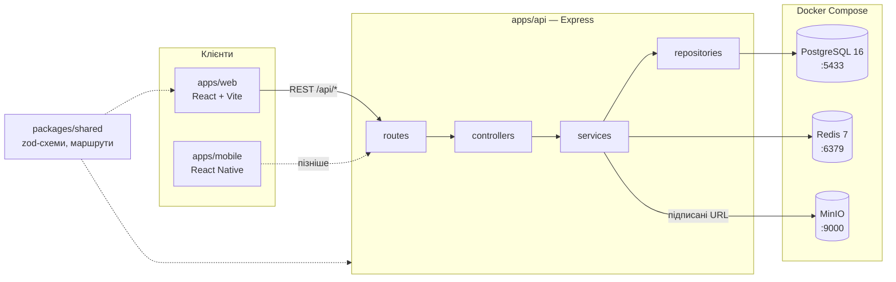

<div align="center">

# Vexa

**Україномовний маркетплейс навчальних курсів і матеріалів**

Автор публікує курс або файловий комплект — учень купує і проходить його на сайті чи в мобільному застосунку.
Дипломний проєкт.

[](https://github.com/terekh373/Vexa/actions/workflows/ci.yml)
[](package.json)
[](apps/api)
[](docker-compose.yml)
[](apps/api/prisma/schema.prisma)
[](apps/web)
[](LICENSE)

[Швидкий старт](#-швидкий-старт) •
[Стек](#-стек) •
[Структура](#-структура-монорепо) •
[Скрипти](#-npm-скрипти) •
[Демо-акаунти](#-демо-акаунти) •
[Документація](#-документація) •
[Проблеми](#-типові-проблеми)

</div>

---

> **Джерело істини — [Технічне завдання](docs/Технічне_завдання_Vexa.pdf).**
> Якщо код або цей README йому суперечать, правильне ТЗ.

## ⚡ Швидкий старт

Для тих, хто вже налаштував машину (Node 20+, Docker Desktop, Git). Детальні кроки з ознаками успіху — [нижче](#-перший-запуск).

```cmd
git clone https://github.com/terekh373/Vexa.git C:\diploma\vexa
cd C:\diploma\vexa
npm install
copy apps\api\.env.example apps\api\.env
:: заповнити JWT_ACCESS_SECRET і JWT_REFRESH_SECRET — див. "Секрети"
npm run db:up
npm run db:migrate
npm run db:seed
npm run dev:api
```

В окремому вікні:

```cmd
npm run dev:web
```

API → http://localhost:3000/api/health &nbsp;•&nbsp; Веб → http://localhost:5173 &nbsp;•&nbsp; Пароль усіх демо-акаунтів — `Vexa12345!`

## 🧱 Стек

| Шар | Технології |
|---|---|
| **API** | Node.js 20 · Express 5 · TypeScript (strict) · Prisma 6 · zod · argon2 · JWT (access + refresh) |
| **База даних** | PostgreSQL 16 |
| **Кеш / сесії** | Redis 7 |
| **Файли** | S3-сумісне сховище, підписані посилання. Локально — MinIO, стейджинг/прод — Cloudflare R2 |
| **Відео** | Cloudflare Stream (HLS) |
| **Веб** | React 19 · Vite · react-router · styled-components · **JavaScript** |
| **Мобільний** | React Native (Expo) · TypeScript. Зараз порожній каркас — стартує після стабілізації веб-MVP (ТЗ, розділ 17) |
| **Інфраструктура** | Docker Compose локально · GitHub Actions (CI) · Vercel для вебу · Railway / Render для API (ТЗ, розділ 6) |

> [!IMPORTANT]
> **Веб-клієнт пишеться на JavaScript (JSX), не на TypeScript.** Так визначено в ТЗ, розділ 6 «Технології веб-розробки».
> Бекенд, `packages/shared` і мобільний застосунок — на TypeScript зі строгою типізацією (те саме ТЗ).
> Ніхто не починає міграцію вебу на TypeScript з власної ініціативи.
>
> Наслідок: розбіжності між клієнтом і API ловить не компілятор, а документ
> [`docs/frontend-api-map.md`](docs/frontend-api-map.md). Його оновлює кожен, хто змінює відповідь API.

### Як усе з'єднано



Шари в API суворо розділені: бізнес-логіка тільки в `*.service.ts`, SQL/ORM тільки в `*.repository.ts`,
валідація вхідних даних — zod на межі API у `*.validation.ts`. Права ролей (guest / student / author / admin)
перевіряються на сервері через middleware — ніколи на клієнті.

## 📁 Структура монорепо

Один репозиторій, npm workspaces. Пакети посилаються один на одного за іменем (`@vexa/shared`), а не за відносним шляхом.

```
Vexa/
├── apps/
│   ├── api/                 # @vexa/api — REST API (Express + Prisma)
│   │   ├── prisma/          # schema.prisma, migrations/, seed.ts, seed-catalog.ts
│   │   ├── src/
│   │   │   ├── config/      # env.ts — валідація змінних оточення на старті
│   │   │   ├── lib/         # prisma, redis, s3, logger, errors, crypto
│   │   │   ├── middleware/  # authenticate, requireRoles, errorHandler
│   │   │   └── modules/     # auth, courses, files, health
│   │   └── .env.example     # шаблон .env для API
│   ├── web/                 # @vexa/web — React + Vite, JavaScript
│   └── mobile/              # @vexa/mobile — каркас, поки без коду
├── packages/
│   └── shared/              # @vexa/shared — спільний контракт: zod-схеми, маршрути, типи
├── docs/                    # ТЗ, схема БД (DBML), карта API, регламент Git
├── .github/                 # CI (ci.yml), CODEOWNERS, шаблон PR
├── docker-compose.yml       # Postgres + Redis + MinIO для локальної розробки
└── package.json             # кореневі скрипти, що прокидаються у воркспейси
```

## 🖥️ Вимоги до машини

| Що | Версія | Перевірити |
|---|---|---|
| Node.js | 20+ (`engines` у package.json) | `node -v` → `v20.x` або вище |
| npm | 10+ (іде з Node 20) | `npm -v` |
| Docker Desktop | актуальна, з увімкненим WSL 2 | `docker compose version` |
| Git | 2.40+ | `git --version` |

> [!NOTE]
> PostgreSQL, Redis і MinIO нативно ставити **не треба** — вони підіймаються в Docker.
> Docker Desktop має бути запущений перед `npm run db:up`.

## 🔧 Налаштування Git на Windows

Один раз на машині, до першого клонування. Кожен рядок — реальна проблема, на яку хтось уже наступав.

```cmd
git config --global user.name "Ім'я Прізвище"
git config --global user.email "your@email.com"
git config --global core.autocrlf true
git config --global core.longpaths true
git config --global core.quotepath false
git config --global pull.rebase false
```

<details>
<summary><b>Навіщо кожен параметр</b></summary>
<br/>

| Параметр | Навіщо |
|---|---|
| `core.autocrlf true` | Windows пише `CRLF`, у репозиторії — `LF`. Для файлів, які покриває `.gitattributes` (`* text=auto eol=lf`), Git нормалізує переводи рядків сам; `autocrlf` страхує все інше, щоб у diff не з'являлися «змінені» файли, де змінився лише перевід рядка |
| `core.longpaths true` | Шляхи в `node_modules` перевищують ліміт Windows у 260 символів. Без цього `git status` і `checkout` падають з `Filename too long` |
| `core.quotepath false` | У `docs/` є файли з кирилицею в назві. Без цього `git status` показує їх як `"\320\242\320\265..."` |
| `pull.rebase false` | Явно фіксує звичайний merge при `git pull`, щоб Git не ставив питання під час першого pull |

</details>

Повний регламент — [`docs/vexa-git-workflow.html`](docs/vexa-git-workflow.html) (відкрити у браузері). Коротко:

```
issue → гілка feature/<номер>-<опис> від свіжого develop → комміти (Conventional Commits) → PR із зеленим CI → Squash and merge
```

`develop` — інтеграційна гілка, `main` — стабільний код. Напряму в них ніхто не пушить.

## 🚀 Перший запуск

Команди для `cmd`. Кожен крок має **ознаку** — рядок у консолі, за яким видно, що крок вдався. Не переходьте далі, поки її немає.

<details open>
<summary><b>1. Клонувати</b></summary>

URL — із великою `V`; зі строчною GitHub редіректить із попередженням, і частина інструментів на це не розрахована.

```cmd
git clone https://github.com/terekh373/Vexa.git C:\diploma\vexa
cd C:\diploma\vexa
```

✅ `git branch` показує `* develop`.
</details>

<details open>
<summary><b>2. Встановити залежності</b></summary>

Один раз для всіх воркспейсів.

```cmd
npm install
```

✅ В кінці виводу `Generated Prisma Client` — `postinstall` виконав `prisma generate` для `@vexa/api`. База даних для цього не потрібна.
Попередження `npm warn deprecated` — нормально, `ERR!` — ні.
</details>

<details open>
<summary><b>3. Створити <code>.env</code> для API</b></summary>

Шаблон лежить у `apps/api`, не в корені.

```cmd
copy apps\api\.env.example apps\api\.env
```
</details>

<details open>
<summary><b>4. Заповнити секрети</b></summary>

Відкрийте `apps\api\.env` і заповніть **тільки** `JWT_ACCESS_SECRET` і `JWT_REFRESH_SECRET`.
Решта вже налаштована під локальний Docker. Як згенерувати — у розділі [Секрети](#-змінні-оточення-й-секрети).
</details>

<details open>
<summary><b>5. Підняти інфраструктуру</b></summary>

Docker Desktop має бути запущений.

```cmd
npm run db:up
```

✅ `docker compose ps` показує `vexa-postgres-1`, `vexa-redis-1`, `vexa-minio-1` у стані `running (healthy)`.
`vexa-minio-init-1` у стані `exited (0)` — нормально: він одноразово створює бакет `vexa-dev` і завершується.
Перший запуск тягне образи, це 1–3 хвилини.
</details>

<details open>
<summary><b>6. Застосувати міграції</b></summary>

```cmd
npm run db:migrate
```

✅ Список застосованих міграцій (`20260726204441_init`, `20260726204632_constraints_and_checks`, `20260729100000_catalog_search`, …)
і в кінці `Your database is now in sync with your schema`. При повторному запуску — `Already in sync, no schema change or pending migration was found.`

Попередження `package.json#prisma is deprecated` і банер `Update available 6.x -> 8.0.0-rc` — ігнорувати.
Prisma **не оновлюємо** без рішення тимліда: це мажорна версія зі зламними змінами.

Якщо Prisma запитує **назву нової міграції** — схема розійшлася з міграціями. `Ctrl+C` і напишіть тимліду.
</details>

<details open>
<summary><b>7. Залити демо-контент</b></summary>

```cmd
npm run db:seed
```

✅ `Seed done: 5 users, 3 courses, 1 orders.` і рядок із паролем демо-акаунтів.

Сід ідемпотентний — його можна запускати повторно. Для тестування каталогу (сітки, пагінація, фільтри)
є ще ~24 курси: `npm run db:seed:catalog` — **після** основного сіду.
</details>

<details open>
<summary><b>8. Запустити API</b></summary>

```cmd
npm run dev:api
```

✅ `API server started {"port":3000,"env":"development"}`.

Контрольна точка — в іншому вікні:

```cmd
curl http://localhost:3000/api/health
```

Має повернути `{"status":"ok","dependencies":{"database":"up","cache":"up"}}`.
Якщо `database` або `cache` — `down`: API стартував, але не бачить Docker. Повернутися до кроку 5.
</details>

<details open>
<summary><b>9. Запустити веб</b></summary>

В окремому вікні `cmd`; API лишається працювати в першому.

```cmd
npm run dev:web
```

✅ `Local: http://localhost:5173/`. Відкрийте в браузері, увійдіть під будь-яким [демо-акаунтом](#-демо-акаунти).

Веб бере адресу API зі змінної `VITE_API_URL`. За замовчуванням це `http://localhost:3000`, тому `apps/web/.env.local`
для локальної роботи створювати не обов'язково. Шаблон — `apps/web/.env.example`.
</details>

## 🔌 Порти

| Порт | Сервіс | Примітка |
|:---:|---|---|
| `3000` | API | `PORT` у `apps/api/.env` |
| `5173` | Веб (Vite dev server) | у `CORS_ORIGINS` API дозволено саме цей origin |
| **`5433`** | PostgreSQL у Docker | ⬇️ див. нижче |
| `6379` | Redis у Docker | |
| `9000` | MinIO — S3 API | сюди ходить API за `S3_ENDPOINT` |
| `9001` | MinIO — веб-консоль | http://localhost:9001 · `minioadmin` / `minioadmin` |

> [!WARNING]
> **Чому Postgres на 5433, а не на стандартному 5432.** На Windows часто стоїть нативна служба PostgreSQL
> (ставиться разом із pgAdmin, DBeaver-плагінами тощо), яка вже займає 5432. Тоді `docker compose up` падає
> з `port is already allocated`, або — гірше — API **тихо підключається до чужої порожньої бази** і всі запити
> повертають 404. Тому в `docker-compose.yml` контейнер прокинуто як `5433:5432`, а `DATABASE_URL` у `.env.example`
> вказує на `localhost:5433`. Ці два місця мають збігатися; міняти порт поодинці не треба.

## 🔐 Змінні оточення й секрети

`.env` — у `.gitignore` і **ніколи не комітиться**. У репозиторії живе тільки `.env.example` з порожніми або локальними значеннями.
Додали нову змінну в код — додайте її в `.env.example` порожньою в тому ж PR.

На старті API валідує оточення (`apps/api/src/config/env.ts`, zod) і падає з переліком проблемних змінних,
якщо чогось бракує. Це очікувана поведінка, а не баг.

### Що заповнювати вручну

Тільки два JWT-секрети, кожен — **окреме** значення від 32 символів (HS256 використовує HMAC-SHA256, коротший ключ послаблює підпис).
Виконати **двічі**, результати вставити в різні змінні:

```cmd
node --input-type=module -e "import {randomBytes} from 'node:crypto'; console.log(randomBytes(48).toString('base64url'))"
```

Той самий сніпет є коментарем у `.env.example`.

### Що не чіпати локально

| Група | Стан за замовчуванням |
|---|---|
| `DATABASE_URL`, `REDIS_URL` | вказують на Docker із `docker-compose.yml` |
| `S3_*` | локальний MinIO; бакет `vexa-dev` створюється автоматично |
| `CORS_ORIGINS` | `http://localhost:5173` — Vite |
| `PLATFORM_COMMISSION_BPS`, `PAYOUT_MIN_AMOUNT`, `REFUND_WINDOW_DAYS` | значення з ТЗ: 15 %, 500 грн, 14 днів. Гроші всюди — **цілі копійки** |
| `CF_STREAM_*`, `LIQPAY_*` | порожні / `sandbox_`. Потрібні лише для задач з відео та оплатою; ключі видає тимлід |

## 📜 npm-скрипти

Кореневі скрипти — аліаси, що прокидаються у воркспейс через `npm run <script> --workspace <name>`. Запускати з кореня репозиторію.

### Корінь

| Команда | Що робить |
|---|---|
| `npm run db:up` / `db:down` | Підняти / погасити Postgres, Redis і MinIO в Docker. Дані лишаються у volume |
| `npm run db:migrate` | Застосувати міграції (`prisma migrate dev`). Якщо схема змінилася — створить нову |
| `npm run db:seed` | Залити демо-контент. Ідемпотентно |
| `npm run db:seed:catalog` | Додати ~24 курси для тестування каталогу. Тільки після `db:seed` |
| `npm run db:studio` | Prisma Studio — переглядати дані в браузері |
| `npm run db:reset` | ⚠️ Знести локальну БД, накатити міграції і сід заново. **Дані втрачаються** |
| `npm run dev:api` | API у watch-режимі (`tsx watch`) |
| `npm run dev:web` | Веб на Vite. Те саме, що `npm run dev --workspace @vexa/web` |
| `npm run lint` | ESLint для TypeScript-пакетів (api, shared, mobile) |
| `npm run typecheck` | `tsc --build` для всіх TS-пакетів + окремо для `prisma/seed*.ts` |
| `npm run build` | Зібрати всі воркспейси |

### Воркспейси

| Команда | Що робить |
|---|---|
| `npm run lint --workspace @vexa/web` | oxlint для веб-клієнта — єдиний автоматичний гейт вебу, бо TypeScript там немає |
| `npm run db:generate --workspace @vexa/api` | Перегенерувати Prisma Client. Автоматично при `npm install`; вручну — після зміни `schema.prisma` |
| `npm run db:deploy --workspace @vexa/api` | `prisma migrate deploy` — застосувати міграції без створення нових. Для CI/деплою |
| `npm run db:validate --workspace @vexa/api` | Перевірити синтаксис `schema.prisma` |
| `npm run db:dbml:check --workspace @vexa/api` | Перевірити, що `docs/schema.dbml` компілюється |
| `npm run build --workspace @vexa/web` | Продакшн-збірка вебу (те, що робить Vercel) |

> [!TIP]
> **Перед відкриттям PR** прожени те саме, що прожене CI — інакше PR буде червоний:
> ```cmd
> npm run lint && npm run lint --workspace @vexa/web && npm run typecheck && npm run build
> ```

## 👤 Демо-акаунти

Створюються `npm run db:seed`. Пароль у всіх: **`Vexa12345!`**. Email підтверджено, реєстрацію проходити не треба.

| Email | Ролі | Для чого |
|---|---|---|
| `admin@vexa.ua` | 🛡️ ADMIN, STUDENT | Адмін-панель, черга модерації (там уже є курс у статусі `MODERATION`) |
| `iryna@vexa.ua` | ✍️ AUTHOR (верифікована), STUDENT | Кабінет автора: опублікований онлайн-курс (модулі → уроки → тест) і чернетка на модерації |
| `oleh@vexa.ua` | ✍️ AUTHOR, STUDENT | Автор файлового матеріалу з одним продажем: є запис у балансі й сповіщення |
| `oksana@vexa.ua` | 🎓 STUDENT | Купила матеріал і залишила відгук — повний цикл покупки |
| `dmytro@vexa.ua` | 🎓 STUDENT | Посеред курсу (33 %) — для плеєра і прогресу |

Усі id в сіді фіксовані (адмін — `10000000-0000-4000-8000-000000000001`), тож їх зручно підставляти
в ручні SQL-запити й Prisma Studio.

## 📚 Документація

| Файл | Що там |
|---|---|
| [`docs/Технічне_завдання_Vexa.pdf`](docs/Технічне_завдання_Vexa.pdf) | ТЗ — джерело істини для вимог, ролей, статусів, грошей |
| [`docs/frontend-api-map.md`](docs/frontend-api-map.md) | Контракт між вебом і API: маршрути, тіла запитів/відповідей, коди помилок. Оновлюється в кожному PR, що змінює відповідь API |
| [`docs/schema.dbml`](docs/schema.dbml) | Схема БД у DBML для ER-діаграм (dbdiagram.io → Import). Джерело істини для коду — `apps/api/prisma/schema.prisma` |
| [`docs/vexa-git-workflow.html`](docs/vexa-git-workflow.html) | Регламент Git: гілки, комміти, PR, ревʼю, що робити, коли щось пішло не так |
| [`.github/pull_request_template.md`](.github/pull_request_template.md) | Чекліст, який заповнюється в кожному PR |

## 🩹 Типові проблеми

<details>
<summary><code>error during connect: ... dockerDesktopLinuxEngine</code> при <code>npm run db:up</code></summary>
<br/>Docker Desktop не запущений. Запустіть і повторіть.
</details>

<details>
<summary><code>Bind for 0.0.0.0:5433 failed: port is already allocated</code></summary>
<br/>На машині вже є контейнер або служба на 5433. <code>docker ps</code> покаже чужий контейнер; якщо це старий <code>vexa-postgres-1</code> — <code>npm run db:down</code> і знову <code>db:up</code>.
</details>

<details>
<summary><code>Invalid environment configuration:</code> і список змінних при старті API</summary>
<br/>Не заповнені або закороткі <code>JWT_*_SECRET</code>, або <code>.env</code> лежить не в <code>apps/api</code>. Це валідація з <code>env.ts</code>, вона навмисно зупиняє запуск.
</details>

<details>
<summary><code>Missing script: "db:migrate"</code></summary>
<br/>Команда запущена не з кореня репозиторію. <code>cd C:\diploma\vexa</code>.
</details>

<details>
<summary>API стартує, але <code>/api/health</code> віддає <code>"database":"down"</code></summary>
<br/>Контейнер Postgres ще не healthy або порт у <code>DATABASE_URL</code> не збігається з <code>docker-compose.yml</code>. <code>docker compose ps</code> і перевірте <code>5433</code>.
</details>

<details>
<summary><code>Property 'xxx' does not exist on type 'PrismaClient'</code> після <code>git pull</code></summary>
<br/>Схема змінилася, а клієнт старий. <code>npm run db:generate --workspace @vexa/api</code>, потім <code>npm run db:migrate</code>.
</details>

<details>
<summary><code>Filename too long</code> при <code>git checkout</code></summary>
<br/>Не виставлено <code>core.longpaths</code>. Див. <a href="#-налаштування-git-на-windows">Налаштування Git</a>.
</details>

<details>
<summary>Веб відкривається, але всі запити падають із CORS</summary>
<br/>API запущено на іншому порту, або веб не на 5173. <code>CORS_ORIGINS</code> у <code>apps/api/.env</code> має містити origin, з якого відкрито веб.
</details>

<br/>

> Якщо проблеми немає в цьому списку і ви витратили більше 20 хвилин — пишіть у чат команди. Спитати дешевше, ніж втратити день.

---

<div align="center">
<sub>MIT © 2026 Tereshchenko Anton · Дипломний проєкт</sub>
</div>
